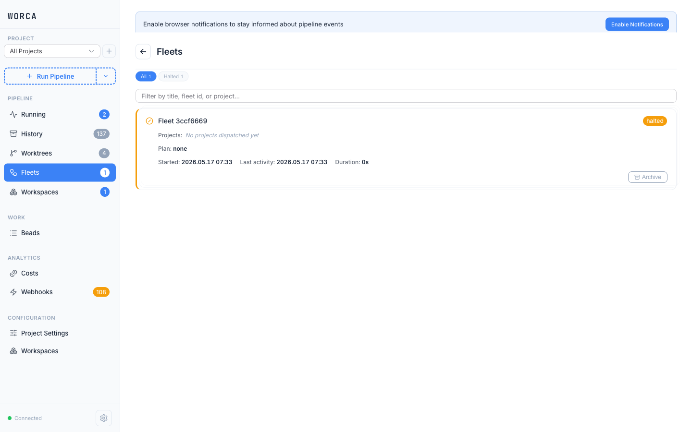
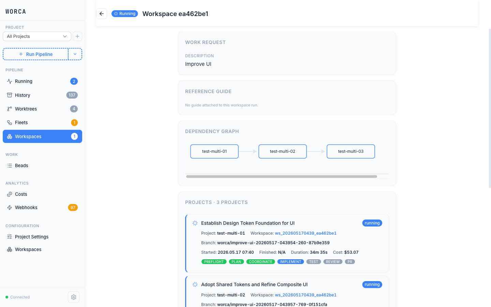

# worca-cc

Autonomous software development pipeline with governance enforcement.

worca — **W**orkflow **ORC**hestration for **A**gents — is a multi-agent pipeline that plans, coordinates, implements, tests, reviews, and learns from code changes autonomously. It runs as a `.claude/` folder you drop into any project — fully configurable, with safety hooks at every stage.


## Features

### Pipeline

- **9-stage pipeline** — Preflight → Plan → Plan Review → Coordinate → Implement → Test → Review → PR → Learn
- **8 specialized agents** — Planner, Plan Reviewer, Coordinator, Implementer, Tester, Reviewer, Guardian, and Learner (model and max turns fully configurable per agent)
- **Pause, stop & resume** — pause mid-stage with clean checkpointing, stop with SIGTERM, resume from where you left off; the UI has pause/resume/stop buttons with real-time state transitions and force-cancel for stale runs
- **Circuit breakers** — error classification with halt thresholds; when a stage fails too many times, the circuit breaker trips and prevents runaway cost
- **Preflight checks** — language-agnostic environment validation that always runs before spending tokens, catching git state issues, missing dependencies, and configuration problems
- **Post-run retrospective (LEARN stage)** — optional stage that analyzes what went well, what failed, and why; produces ranked observations with actionable suggestions and copy-to-clipboard prompts for improving future runs
- **Adaptive reasoning effort** — per-agent effort levels (`low` → `max`); in the default adaptive mode the coordinator labels each task's complexity and the implementer starts there and escalates on retries (capped by `auto_cap`); the resolved level shows as a per-iteration badge in the UI

### Work Sources & Integration

- **Multiple input modes** — prompt, spec file, GitHub issue (`gh:issue:42`), beads task (`bd:bd-abc`), or issue URL
- **Reference guides** (`--guide`) — inject a normative spec, RFC, or migration guide into every agent's context; the guide is the highest-authority source (**guide > plan > description**), repeatable, and supported on in-place, worktree, fleet, and workspace runs
- **GitHub issue lifecycle** — start from issues with `--source gh:issue:N`, auto-post progress comments, link PRs, close issues on completion
- **Guided issue triage** (`/worca-analyze`) — Claude Code skill that analyzes a GitHub issue, surfaces open design decisions with recommended options, optionally writes a `## Decisions` section back to the issue body, recommends the right pipeline template, and offers to launch a worktree-based pipeline — all in one pass
- **Guided template authoring** (`/worca-template`) — Claude Code skill that interviews you about your pipeline needs, proposes reusing or extending an existing template, asks for project-vs-user scope, and writes a minimal-delta `template.json` via the CLI — no hand-editing required
- **Multi-host PR metadata** (W-051) — provider detection across GitHub, GitLab, Bitbucket, Azure DevOps, and Gitea; PR stage records commit SHA, source/target branch flow, and draft/review status; UI surfaces a collapsible "PR details" panel on the PR stage card
- **Smart title generation** — `--prompt` is optional; when omitted, the title is generated from the spec or plan file and sanitized for branch names
- **Pipeline events & webhooks** — 80+ structured event types emitted as a real-time JSONL stream; subscribe via configurable webhooks with HMAC-SHA256 signing, retry logic, and secret management; control webhooks can pause or abort the pipeline

### Governance & Safety

- **Governance hooks** — block dangerous operations (rm -rf, force push, env writes), enforce test gates, validate plans (each guard can be toggled independently)
- **Configurable subagent dispatch** — per-agent allowlists control which Claude Code subagents each pipeline agent can spawn; `general-purpose` is denied by default (opt an agent in explicitly when needed); dispatch events render as green/red badges per iteration in the UI
- **Human approval gates** — optional checkpoints after planning, before merge, and before deploy (configurable per gate)
- **Token and cost tracking** — per-agent usage with model-specific pricing, web search/fetch cost tracking, cache tier breakdown, budget warnings at configurable thresholds

### Pipeline Templates

- **Built-in templates** — `feature`, `bugfix`, `quick-fix`, `refactor`, `investigate`, `test-only` — each with tailored stage flows, agent selection, and governance rules for different work types. `investigate` publishes its plan as a PR (W-046); `test-only` runs tests and coverage analysis without code changes
- **Template selection UI** — styled dropdown on the new-run page with group headers, descriptions, and indentation; also selectable via CLI
- **Agent prompt overrides** — templates wire their own agent prompt overrides through the overlay resolver, so each work type gets purpose-built instructions
- **Guided authoring** — `/worca-template` walks you through creating a new template with a reuse-first interview, minimal config delta, and explicit scope selection; backed by `worca templates create --from-file` for validated writes

### Customization

- **Agent prompt overlays** — add `.claude/agents/<agent>.md` to customize agent instructions per-project without modifying core templates; overlay blocks can **append** to or **replace** (via `<!-- replace -->`) targeted sections; governance-protected sections cannot be replaced
- **Local settings** — `settings.local.json` deep-merges machine-specific overrides that aren't committed to git
- **Loop controls** — configurable iteration limits for implement/test cycles, code review, and PR updates (per-loop-type limits + global multiplier)

### Multi-Project Dashboard

- **Global mode** — `worca-ui` monitors all registered projects from one browser tab (default)
- **Sidebar project picker** — dropdown with live status dots (green = healthy, red = errors) and run count badges
- **Add-project dialog** — register projects via the UI with path validation and duplicate detection
- **Batch registration** — `worca-ui migrate --scan ~/dev` discovers and registers all worca-enabled projects in one command
- **Rich bead tooltips** — hover over any bead in Kanban, dependency graph, or list views for structured details with copy button and interactive content
- **Settings UI** (W-049) — edit execution & parallelism, approval gates, circuit breaker thresholds, worktree disk warning, and the new global Preferences tab (`~/.worca/settings.json`) without hand-editing JSON; settings save handler auto-migrates legacy keys

### Parallel Pipelines

- **Worktree-isolated runs** — `worca run --worktree` (or the UI's "Run Pipeline" button) launches each pipeline into its own git worktree with independent `.worca/` state, `.beads/` database, and git branch
- **Concurrency cap** — server-enforced `max_concurrent_pipelines` with launch mutex (returns 409 when at capacity); configurable in the global Preferences tab
- **Three-level UI** — projects → pipelines → stages, with per-pipeline pause/stop/resume controls
- **Configurable cleanup** — `on-success` (remove successful worktrees), `always`, or `never`; default is `never` to preserve worktrees for inspection. Use `worca cleanup` to prune on demand
- **Registry tracking** — all running pipelines are tracked in `.worca/multi/pipelines.d/` for monitoring and stale process recovery

### Fleet Runs

- **Fan-out to N projects** — `worca run` the same work-request across many independent projects in parallel via `run_fleet.py --projects /path/a /path/b /path/c`
- **Shared plan or per-child planning** — supply a single `--plan` for every child, run a `--plan-first` reference plan that others inherit, or let each child plan independently
- **Lifecycle controls** — `--pause`, `--stop`, and `--resume` operate on the whole fleet; circuit breaker auto-halts when the failure ratio crosses `--fleet-failure-threshold`
- **Cross-host PR linking** — each child opens its own PR; the fleet dashboard aggregates per-child status with name chips and a "N failed" counter



### Workspace Runs

- **Coordinated multi-project pipeline** — `worca workspace init <parent>` scaffolds a `workspace.json` from sibling git projects; `run_workspace.py` decomposes one prompt into per-project sub-plans and executes them in DAG tier order
- **Tier-based execution** — projects within a tier run in parallel, tiers wait for prerequisites; between tiers, completed projects' diffs are injected as `--guide` so downstream projects see what changed upstream
- **Cross-project integration test** — optional user-defined command runs after all tiers complete; on failure, no PRs are created
- **Linked PR set** — per-project PRs are created with `Depends on:` / `Blocks:` comments + an umbrella issue listing all PRs in merge order
- **Hard-cut schema** — `workspace.json` uses `projects[]`; a `worca workspace migrate <path>` helper converts legacy `repos[]` files in place
- **Four planning strategies** — unified master plan (default), `--workspace-plan PATH` (reuse a saved `workspace-plan.json`), `--project-plan NAME=PATH` (per-project markdown plans), or `--skip-planning` (each project plans independently); selectable in the UI launcher



## Architecture

```
Preflight → Planner → Plan Reviewer → Coordinator → Implementer(s) → Tester → Reviewer → Guardian → Learner
```

Plan Review and Learn are disabled by default; enable via `worca.stages.plan_review.enabled` / `worca.stages.learn.enabled` in settings.json.

| Agent | Role |
|-------|------|
| **Planner** | Reads work request, explores codebase, creates detailed implementation plan |
| **Plan Reviewer** | Validates plan for completeness, feasibility, and architecture fit; loops back to Planner on critical issues |
| **Coordinator** | Decomposes plan into beads tasks with dependencies and parallel groups |
| **Implementer** | Claims task, implements with TDD, commits code, closes task |
| **Tester** | Runs test suite, verifies coverage, collects proof artifacts |
| **Reviewer** | Reviews code changes for bugs, quality, and convention adherence; approves or requests changes |
| **Guardian** | Verifies test proof, commits code, creates PR, manages human gates |
| **Learner** | Analyzes completed run, produces ranked observations and improvement suggestions |

Governance hooks run at every tool call — `pre_tool_use` enforces guards and plan validation, `post_tool_use` enforces test gates and links beads tasks. The event system emits structured events at each stage transition, bead assignment, error, and governance violation.

## Project Structure

After `worca init`, your project gets:

```
.claude/
  worca/                 # Runtime copy of pipeline (managed, overwritten on upgrade)
  agents/                # Your agent prompt overrides (never touched by upgrade)
  settings.json          # Pipeline configuration
```

## Prerequisites

- Python 3.10+
- Node.js 22+ (for dashboard)
- [Claude Code CLI](https://docs.anthropic.com/en/docs/claude-code) (`claude` command)
- Git
- [beads](https://github.com/gastownhall/beads) CLI for task management and work coordination
  ```bash
  npm install -g @beads/bd@0.49.0
  ```
  Use version 0.49.0 specifically — later versions require Dolt DB, which is not needed for this project.

## Installation

```bash
pip install worca-cc              # Python pipeline + CLI
npm install -g @worca/ui          # Dashboard
npm install -g @beads/bd@0.49.0   # Issue tracking
```

```bash
cd your-project
worca init                        # scaffolds .claude/ with pipeline files
```

To update: `pip install --upgrade worca-cc && worca init --upgrade`

Use `worca init --check` for a dry-run that shows what would change without modifying anything.

**Platforms:** Linux, macOS, and Windows are all supported. worca-ui, the hooks, and the Python library are first-class everywhere; the autonomous pipeline's lifecycle control is POSIX-native and degrades gracefully on native Windows (use WSL2 for full fidelity). See [`docs/platform-support.md`](./docs/platform-support.md).

## Quick Start

```bash
# Interactive — open Claude with pipeline hooks active
cd your-project && claude

# Autonomous — run full pipeline from prompt
worca run --prompt "Add user authentication"

# From spec file or pre-made plan
worca run --spec spec.md --plan plan.md

# From GitHub issue
worca run --source gh:issue:42

# Same, but isolated in a git worktree (parallel-safe; same path the UI uses)
worca run --worktree --source gh:issue:42 --template feature

# With a reference guide (normative — overrides the plan and description)
worca run --prompt "Migrate to the v2 API" --guide migration-spec.md

# Guided triage from a Claude session — analyze the issue, capture design
# decisions back into the issue body, recommend a template, and offer to
# start a new pipeline for it
claude
/worca-analyze 42

# From the dashboard — click "Run Pipeline" in worca-ui
worca-ui                         # monitor all projects (default)
worca-ui --project /path         # monitor single project
worca-ui --help                  # show all commands and options
```

See [CLI Reference](docs/cli-reference.md) for all flags and commands, and the [Issue Triage skill](CONTRIBUTING.md#issue-triage) for what `/worca-analyze` does end to end.

## Dashboard (worca-ui)

A real-time web dashboard for monitoring and controlling the pipeline. All updates stream via WebSocket — no polling, no page refreshes.


See [Dashboard Guide](docs/dashboard.md) for the full screenshot walkthrough.

## Chat Integrations

Get pipeline notifications on your phone and control runs remotely via **Telegram**, **Discord**, **Slack**, or any outbound webhook. Integrations run inside the UI server process — no separate service needed.

- **Telegram** — two-way: push notifications + commands (`/pause`, `/resume`, `/stop`, `/status`, `/cost`, `/pr`)
- **Discord** — outbound push notifications via bot
- **Slack** — outbound push notifications via incoming webhook
- **Generic webhook** — POST to any HTTP endpoint in multiple payload formats (`generic-json`, `slack-compatible`, `ntfy`, etc.)

**Quick start:**
```bash
# 1. Create ~/.worca/integrations/config.json (see docs)
# 2. Set env vars for bot tokens / webhook URLs
export TELEGRAM_BOT_TOKEN=...

# 3. Restart the UI server
pnpm worca:ui:restart

# 4. Verify
worca integrations status
```

See [Chat Integrations Setup Guide](docs/spec/integrations/README.md) for the full configuration reference, BotFather setup, Discord/Slack webhook instructions, strict inbox verification, and the security model.

## Configuration

All configuration lives in `.claude/settings.json` under the `worca` key:

- **`worca.agents`** — model and max_turns per agent (planner, plan_reviewer, coordinator, implementer, tester, reviewer, guardian, learner)
- **`worca.effort`** — adaptive reasoning-effort control: `auto_mode` (`adaptive` default / `reactive` / `disabled`), an `auto_cap` ceiling, and per-agent `effort` levels (`low | medium | high | xhigh | max`). See [docs/effort.md](docs/effort.md)
- **`worca.stages`** — enable/disable pipeline stages (preflight, plan, coordinate, implement, test, review, pr, learn), assign agents
- **`worca.loops`** — iteration limits (implement/test: 5, code review: 5, PR changes: 5, restart planning: 2)
- **`worca.governance`** — guards (block rm -rf, force push, env writes), test gate strike limit, `subagent_dispatch` per-agent allowlists (user config replaces defaults per agent; `general-purpose` denied by default, allowable per-agent)
- **`worca.milestones`** — human approval gates (plan, PR, deploy)
- **`worca.pricing`** — per-model token pricing for cost tracking
- **`worca.circuit_breaker`** — max failures before halting, transient error retry logic
- **`worca.events`** — event emission and webhook configuration (HMAC signing, retry, secret management)
- **`worca.parallel`** — parallel pipeline settings (max_concurrent_pipelines: 3, default_base_branch, cleanup_policy: `on-success`|`always`|`never`, worktree_base_dir)
- **`worca.graphify`** — optional code knowledge-graph integration (off by default); set `enabled: true` to have Preflight build a per-commit graph that agents query on demand for orientation; governance blocks mutating graphify subcommands

### Local overrides

Create `settings.local.json` next to `settings.json` for machine-specific overrides. It deep-merges on top of the base config and is gitignored.

### Agent prompt overlays

Add `.claude/agents/<agent>.md` files to customize agent prompts per-project. Use `## Override: <Section Name>` blocks to target specific sections. Add `<!-- replace -->` as the first line to replace instead of append. Governance-protected sections (marked `<!-- governance -->`) cannot be replaced.

## Documentation

- [CLI Reference](docs/cli-reference.md) — all flags and commands for `worca run`, `worca multi`, `worca init`, `worca-ui`
- [Dashboard Guide](docs/dashboard.md) — full screenshot walkthrough of the monitoring UI
- [Chat Integrations Setup](docs/spec/integrations/README.md) — Telegram, Discord, Slack, webhook config, security model
- [Contributing](CONTRIBUTING.md) — development setup, project structure, linting, testing, and release process
- [Changelog — worca-cc](src/worca/CHANGELOG.md)
- [Changelog — @worca/ui](worca-ui/CHANGELOG.md)

## License

[MIT](LICENSE)
