# Dashboard (worca-ui)

A real-time web dashboard for monitoring and controlling the pipeline. All updates stream via WebSocket — no polling, no page refreshes.

```bash
worca-ui                                  # Monitor all projects (default, port 3400)
worca-ui --project /path                  # Monitor single project
worca-ui --help                           # Show all commands and options
```

## Pipeline Detail

Stage pipeline with iteration counts, costs, duration, and a timing bar showing Thinking vs Tools breakdown. Expand any stage to drill into per-iteration metrics. Pause, resume, and stop controls in the header.


Expand a stage to see individual iterations — each shows agent, turns, cost, duration, and outcome. The log viewer streams real-time agent output with per-stage filtering.

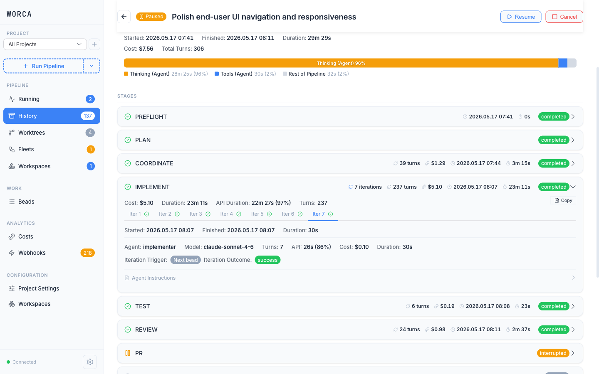

The header shows lifecycle controls — pause, resume, and stop buttons with real-time state transitions and a status badge.

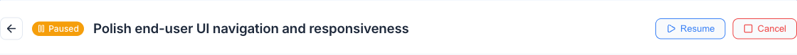

### PR Details

When the PR stage completes, an inline **PR info strip** appears at the bottom of the stage card with the metadata captured by the guardian agent (W-051) — visible the moment the stage is expanded, no second click. Items render only when their data is present:

- Linked PR number with provider-aware external-link icon
- Provider — GitHub, GitLab, Bitbucket, Azure DevOps, or Gitea (auto-detected from the PR URL)
- Short commit SHA with copy-to-clipboard button
- Source → target branch flow
- Review status badge (when surfaced by the host)

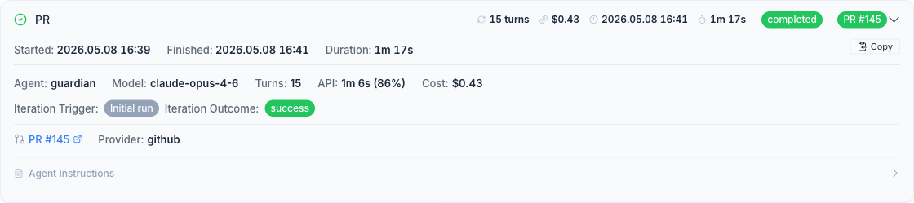

This works across all five supported hosts, so non-GitHub remotes get the same one-glance PR summary.

## Learnings

After a run completes, the LEARN stage produces ranked observations and actionable suggestions. Copy-to-clipboard buttons let you feed insights directly into future runs or agent prompts.

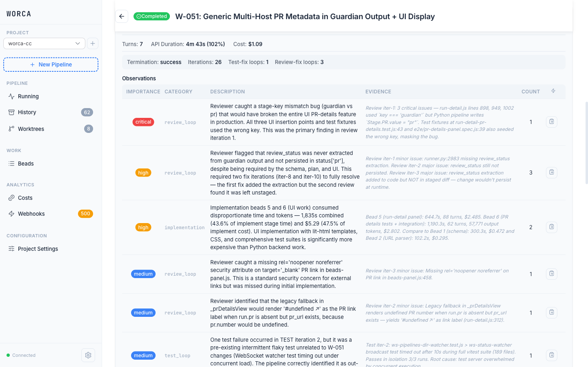

## Global Dashboard

In global mode (the default), the sidebar shows a project picker with all registered projects, live status indicators, and a "New Pipeline" button. Select a project to see its runs, beads, costs, and settings.


The sidebar project picker shows all registered projects with live status dots (green = healthy, red = errors) and run count badges.

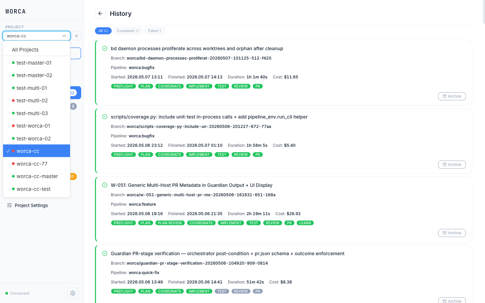

## Add Project

Click the **+** button next to the project picker to register a new project or workspace. Pick **Single project** for a normal directory or **Workspace** to register a folder that groups multiple project clones; the dialog validates the path and auto-generates a slug for the project name.

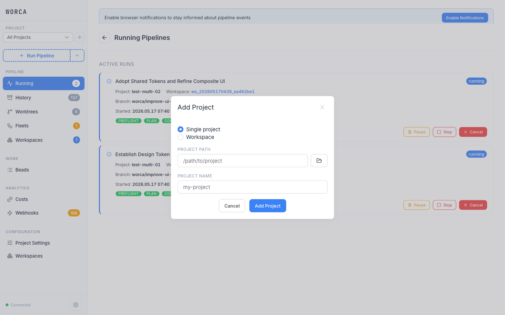

## Run History

Browse completed and interrupted runs sorted newest-first. Each card shows the branch, timing, and stage completion badges.

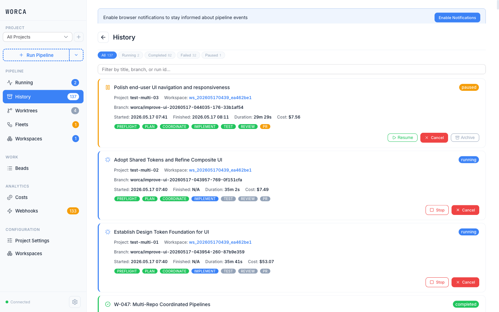

## New Pipeline

Start a run from a prompt, GitHub issue, or spec file. Advanced options for size/loop multipliers, branch selection, and pre-made plan files.

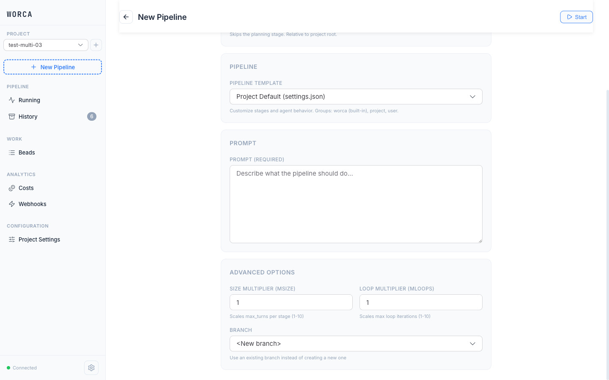

## Beads Issues

Browse runs filtered to those that produced beads. Each card shows the run's branch, template, timing, cost, stage badges, and a closed/total bead count badge (e.g. `7/7 Beads`). Drilling into a run reveals the per-run beads list and dependency graph in the run detail view.


## Token & Cost Dashboard

Per-run cost breakdown with a stage-proportional bar chart. Detailed table showing cost, turns, duration, and API duration per iteration.

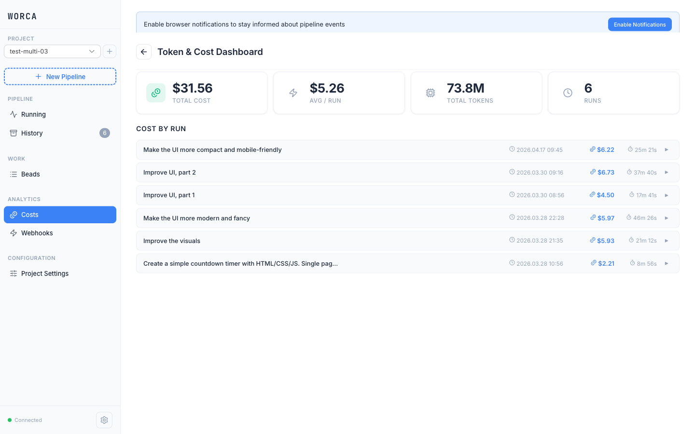

## Settings

Configure agent models and max turns, pipeline stages, governance rules, pricing, webhooks, integrations, and preflight checks — all saved to `.claude/settings.json` and effective immediately without restarting. Saves are locked while a pipeline is running to prevent mid-run config drift.

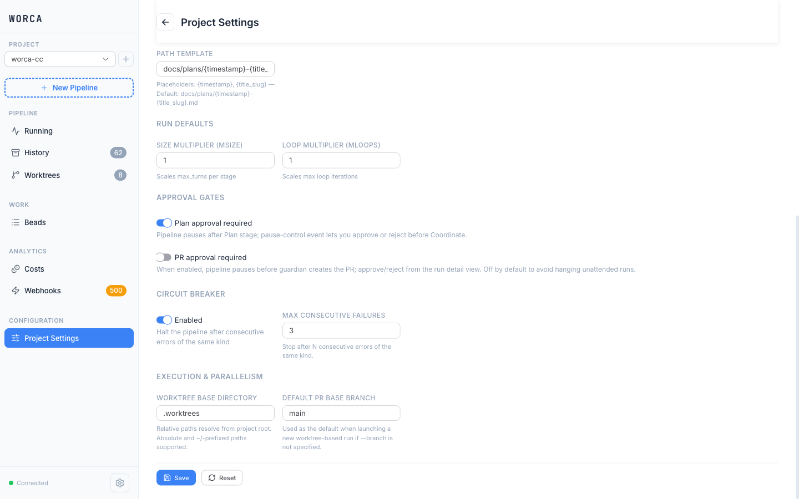

W-049 added four subpanels for previously JSON-only knobs:

- **Execution & Parallelism** — worktree base directory, default PR base branch, max concurrent pipelines, cleanup policy
- **Approval Gates** — plan and PR approval gates (gate the run pre-PR-creation when enabled)
- **Circuit Breaker** — max failures before halting, classifier model selection
- **Preferences** (global, `~/.worca/settings.json`) — cross-project keys: cleanup policy, concurrency cap, worktree disk warning threshold, classifier model

When a project's `.claude/settings.json` still contains misplaced global keys or template-default milestone values, an inline banner offers one-click migration; saving any settings change triggers the same auto-migration on the server side.

Preflight checks validate the environment before spending tokens — catching git state issues, missing dependencies, and configuration problems. Each check can be toggled independently.

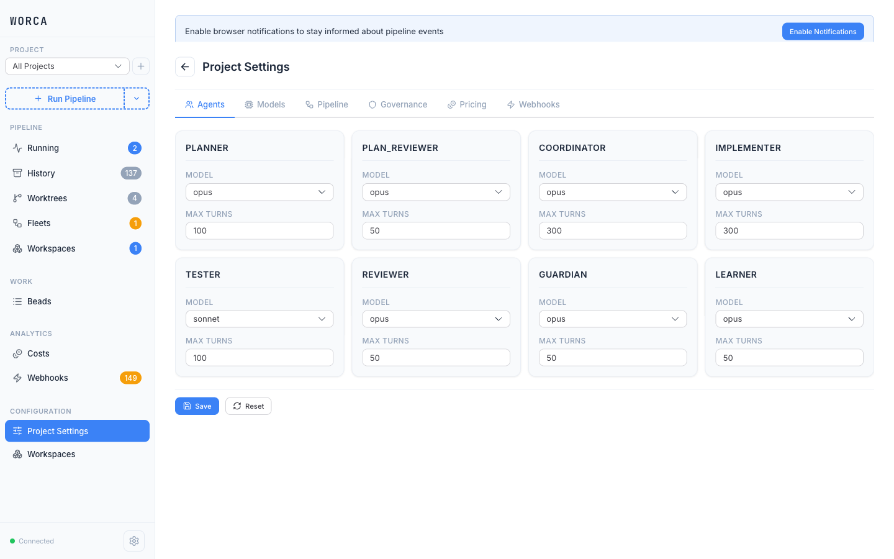

The webhooks panel configures event subscriptions, budget limits, and HMAC-SHA256 signing for pipeline event delivery.

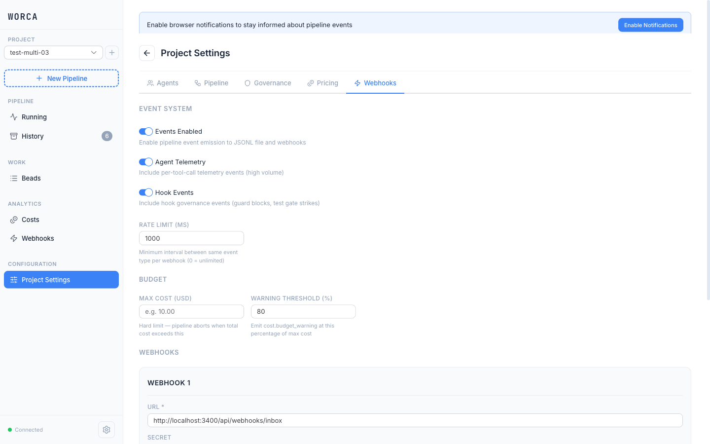

### Integrations

A card-catalog UI for chat integrations (Telegram, Discord, Slack, generic webhook). Each card shows real connection-health badges (polled every 10s while the tab is open), an enable/disable toggle, and Edit/Remove buttons. Adding or updating a project auto-configures its outbound webhook so events route correctly without manual setup.

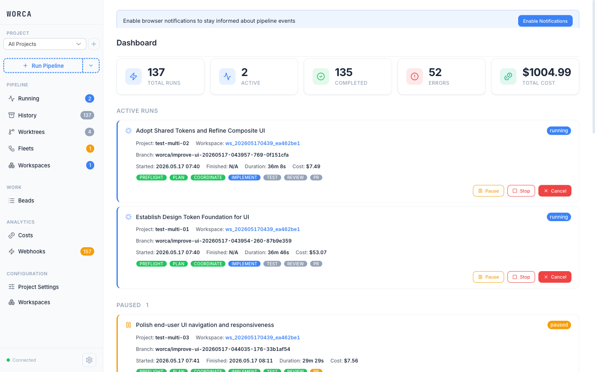

See the [Chat Integrations Setup Guide](spec/integrations/README.md) for the full configuration model and security details.
